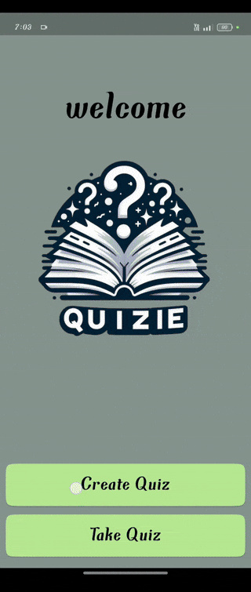
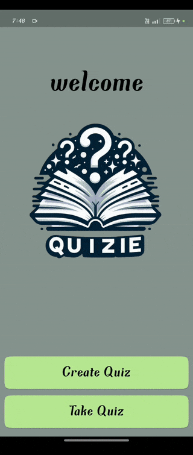
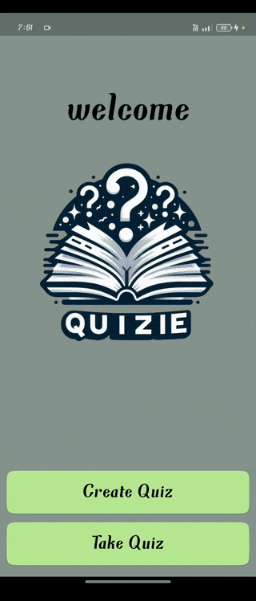
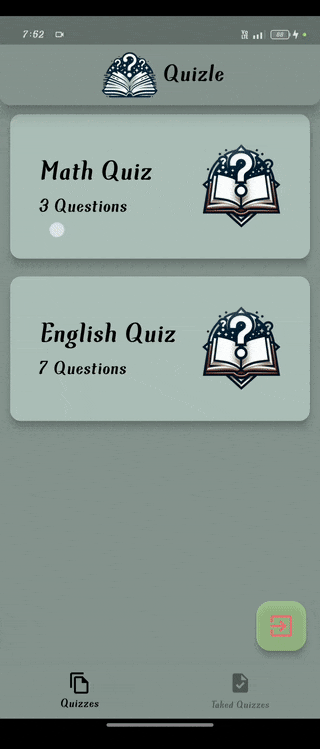
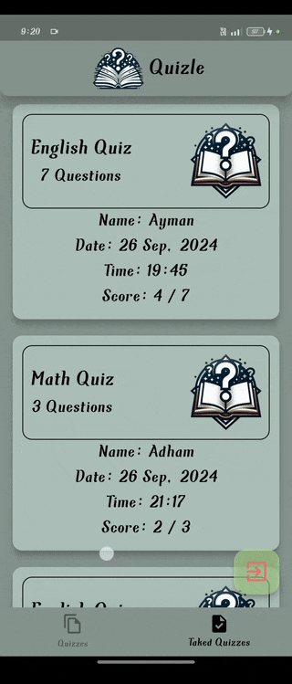

# Flutter Quiz App

This project is a **sample Flutter Quiz application** that integrates **Hive for local data storage** and uses **Cubit for state management**. It allows users to create quizzes, take quizzes, view their past answers, and delete quizzes. The app is designed with a clean user interface, responsive interactions, and persistent data storage.

## Features

- **Quiz Management**: Create, view, update, and delete quizzes.
- **Take Quizzes**: Users can take quizzes and view their answers afterward.
- **Local Storage with Hive**: All data is stored locally using Hive, ensuring data persistence.
- **State Management with Cubit**: The app uses Cubit for efficient state management across different views.
- **Animated Transitions**: Smooth animated transitions between different quiz views using Flutter’s Hero widget.

## Demo

### Creating a Quiz


### Taking a Quiz


### Viewing Last Answers


### Deleting a Quiz


### Deleting a Taken Quiz


## Packages Used

- **flutter_bloc**: State management solution for building scalable and maintainable Flutter applications.
- **hive_flutter**: A lightweight and fast key-value database written in pure Dart.
- **hive_generator**: Generates code to work with Hive’s strongly-typed boxes.
- **intl**: Provides internationalization and localization facilities.
- **flutter_launcher_icons**: A package that simplifies the task of updating your Flutter app’s launcher icon.

## Project Structure

The project is organized into a modular structure, separating the UI components, Cubits, and Hive operations for better scalability and maintainability.

### Cubits Used

- **AddQuizCubit**: Manages the state for creating new quizzes, including quiz questions and answers.
- **QuizCubit**: Handles quiz management, such as updating the list of quizzes and navigating between different quiz views.
- **TakeQuizCubit**: Manages the state while taking a quiz, including handling quiz progression and answer validation.

## Key Widgets

### `CreateQuizView`

This view allows users to create a new quiz by adding questions and answers. It uses `BlocConsumer` to manage the state transitions when creating and saving quizzes.

```dart
class CreateQuizView extends StatelessWidget {
  const CreateQuizView({super.key});

  @override
  Widget build(BuildContext context) {
    final isKeyboardOpen = MediaQuery.of(context).viewInsets.bottom != 0;

    return Scaffold(
      floatingActionButton: isKeyboardOpen
          ? null
          : FloatingActionButton(
              backgroundColor: const Color.fromARGB(142, 184, 232, 147),
              onPressed: () {
                Navigator.pop(context);
              },
              child: Icon(
                Icons.exit_to_app,
                color: Colors.red[300],
                size: 32,
              ),
            ),
      appBar: const CustomAppBarWidget(),
      backgroundColor: const Color(0xff86948F),
      body: BlocProvider(
        create: (context) => AddQuizCubit(),
        child: SingleChildScrollView(
          child: BlocConsumer<AddQuizCubit, AddQuizState>(
            listener: (context, state) {
              if (state is AddQuizSuccess) {
                Navigator.pop(context);
              }
            },
            builder: (context, state) {
              return AnimatedSwitcher(
                duration: const Duration(milliseconds: 400),
                child: state is AddQuizInitial || state is CreateQuizName
                    ? const EnterQuizNameViewBody()
                    : const EnterQuizQuestionViewBody(),
              );
            },
          ),
        ),
      ),
    );
  }
}
```

### `TakeQuizView`

This view allows users to take a selected quiz. It navigates through different quiz states like viewing questions, validating answers, and showing results.

```dart
class TakeQuizView extends StatelessWidget {
  const TakeQuizView({super.key});

  @override
  Widget build(BuildContext context) {
    return BlocProvider(
      create: (context) => QuizCubit(),
      child: Scaffold(
        floatingActionButton: FloatingActionButton(
          backgroundColor: const Color.fromARGB(142, 184, 232, 147),
          onPressed: () {
            Navigator.pop(context);
          },
          child: Icon(
            Icons.exit_to_app,
            color: Colors.red[300],
            size: 32,
          ),
        ),
        appBar: const CustomAppBarWidget(),
        backgroundColor: const Color(0xff86948F),
        body: BlocBuilder<QuizCubit, QuizState>(
          builder: (context, state) {
            final pageIndex = context.read<QuizCubit>().pageIndex;
            return context.read<QuizCubit>().pages[pageIndex];
          },
        ),
        bottomNavigationBar: BlocBuilder<QuizCubit, QuizState>(
          builder: (context, state) {
            return BottomNavigationBar(
              selectedItemColor: Colors.black,
              unselectedItemColor: const Color.fromARGB(105, 0, 0, 0),
              iconSize: 26,
              elevation: 42,
              currentIndex: context.read<QuizCubit>().pageIndex,
              backgroundColor: const Color(0xff86948F),
              items: const <BottomNavigationBarItem>[
                BottomNavigationBarItem(
                  icon: Icon(Icons.file_copy_outlined),
                  label: 'Quizzes',
                ),
                BottomNavigationBarItem(
                  icon: Icon(Icons.task),
                  label: 'Taked Quizzes',
                ),
              ],
              onTap: (index) {
                context.read<QuizCubit>().updatePageIndex(index);
              },
            );
          },
        ),
      ),
    );
  }
}
```

### `TakeAQuizView`

This widget manages the quiz-taking experience, displaying different views based on the quiz state, such as questions, right answers, or completed quizzes.

```dart
class TakeAQuizView extends StatelessWidget {
  const TakeAQuizView({
    super.key,
    required this.quizModel,
    this.imageTag,
  });

  final QuizModel quizModel;
  final int? imageTag;

  @override
  Widget build(BuildContext context) {
    return WillPopScope(
      onWillPop: () async {
        return BlocProvider.of<TakeQuizCubit>(context).isOutQuiz;
      },
      child: Scaffold(
        backgroundColor: const Color(0xff86948F),
        body: BlocConsumer<TakeQuizCubit, TakeQuizState>(
          listener: (context, state) {
            if (state is CloseQuiz) {
              Navigator.pop(context);
            }
          },
          builder: (context, state) {
            if (state is TakeQuizInitial) {
              BlocProvider.of<TakeQuizCubit>(context).fetchQuizLazy(quizModel.key);
              BlocProvider.of<TakeQuizCubit>(context).takedQuizModel.quizId = quizModel.key;
            }
            return SingleChildScrollView(child: bodyView(state, imageTag));
          },
        ),
      ),
    );
  }
}
```

## Getting Started

### Prerequisites

- [Flutter SDK](https://flutter.dev/docs/get-started/install)
- A code editor like [VS Code](https://code.visualstudio.com/) or [Android Studio](https://developer.android.com/studio)

### Installation

1. Clone the repository:
   ```bash
   git clone https://github.com/AdhamElagaty/sample_quiz_app_ui
   ```
2. Install the dependencies:
   ```bash
   flutter pub get
   ```
3. Run the app:
   ```bash
   flutter run
   ```
   
---